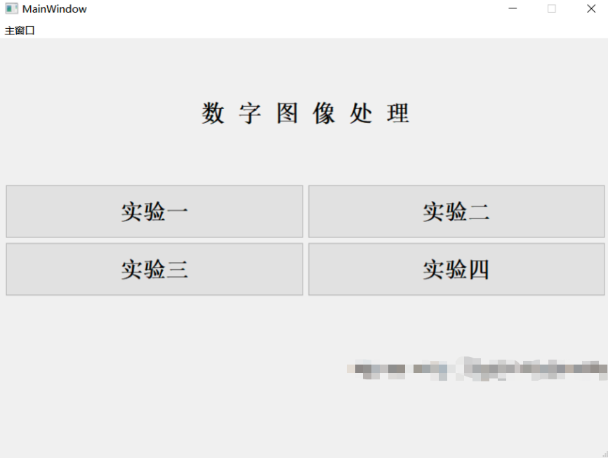
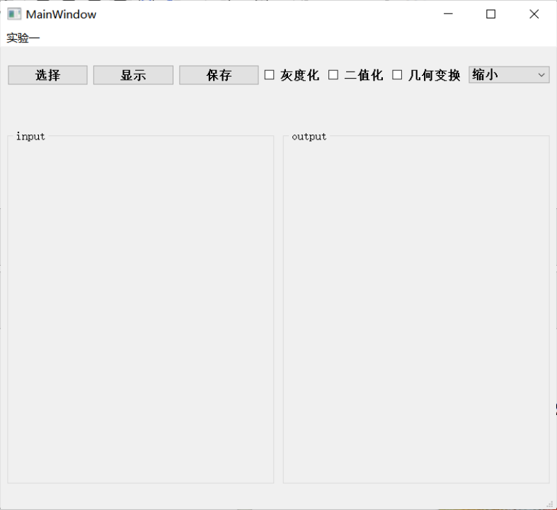
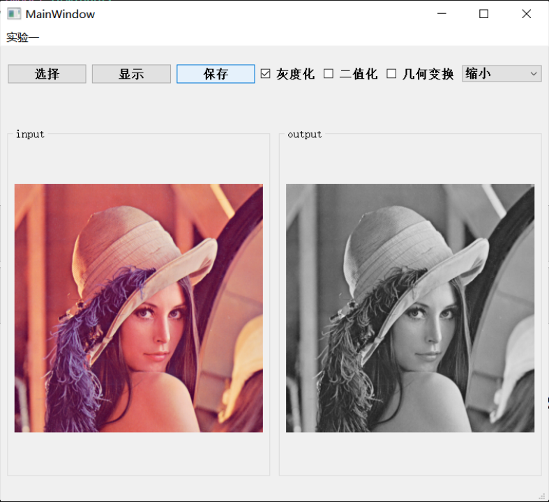
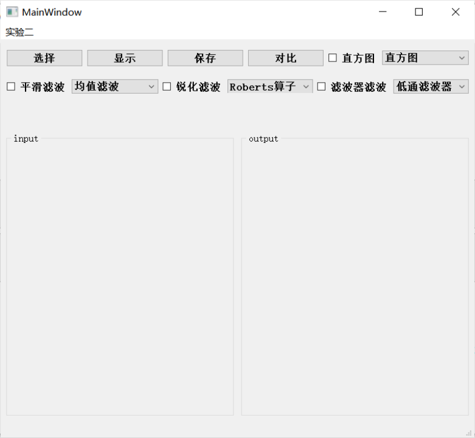
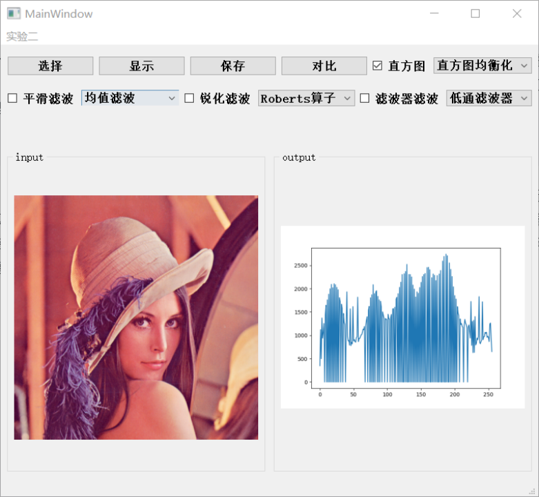
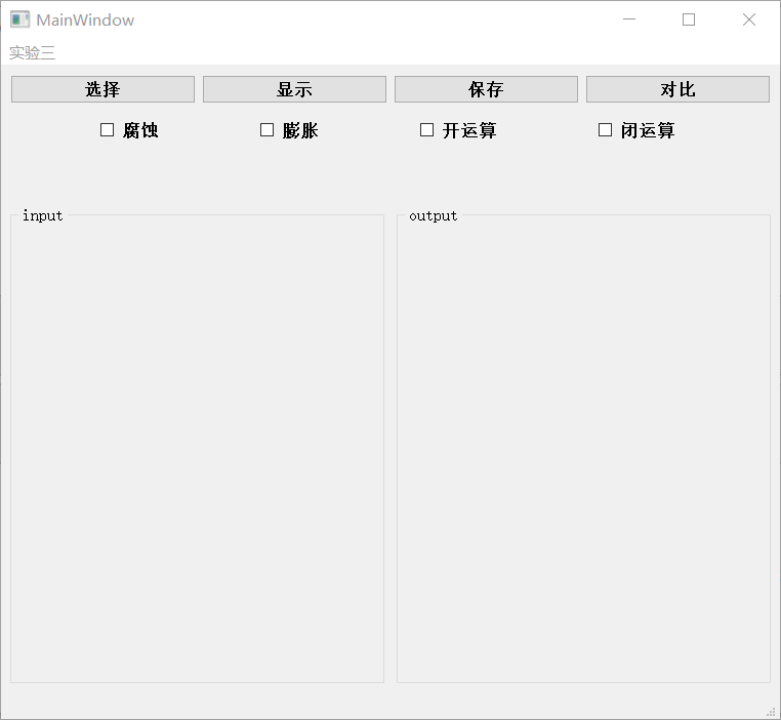
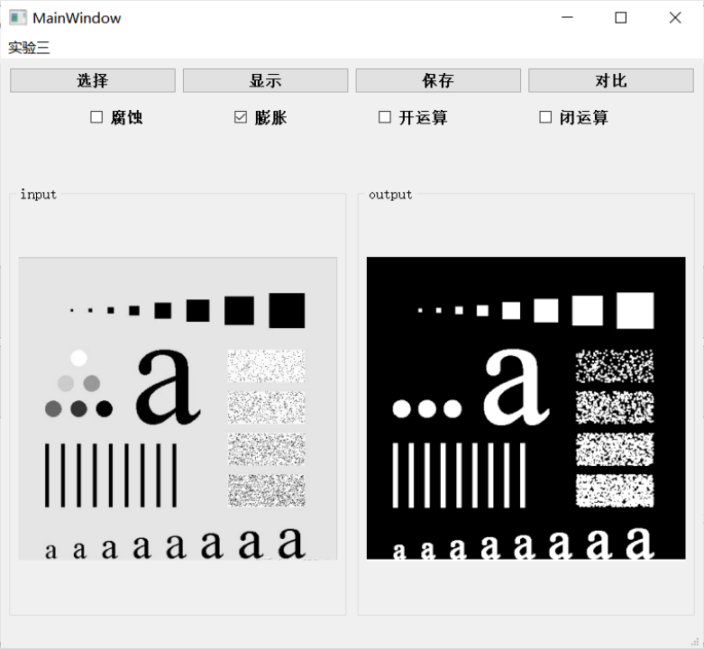
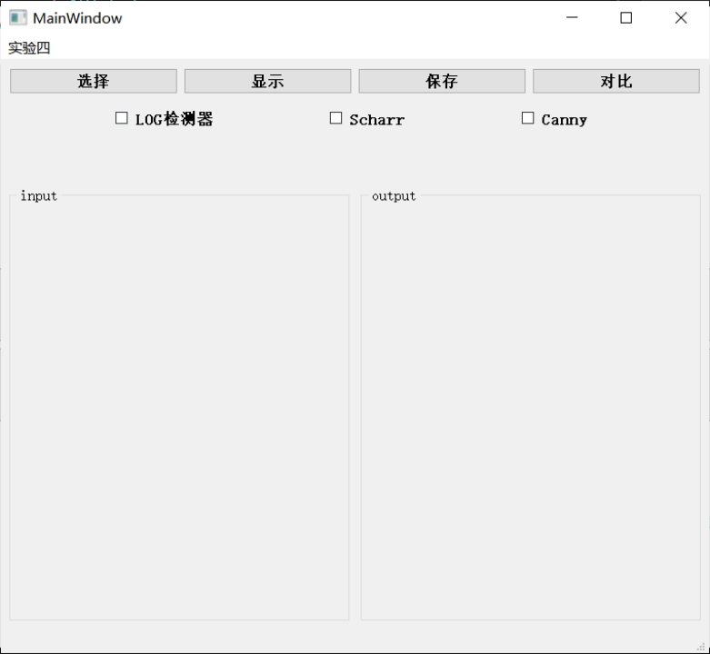
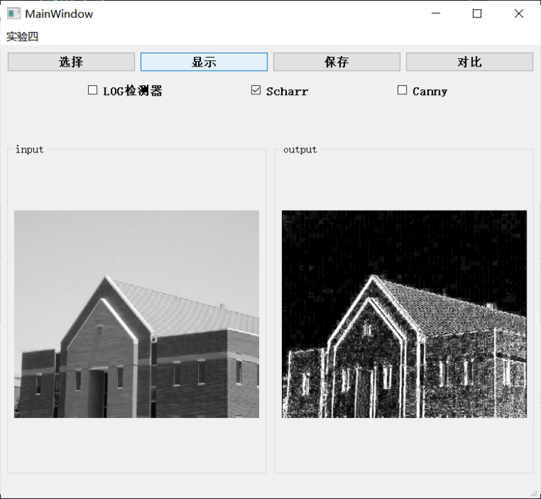

## 项目介绍

基于PyQt的数字图像处理系统，包括图像的读取、显示、基本操作、图像增强、形态学操作和边缘检测等功能。
```bash
python mainWindow.py
```

<div style="text-align: center;">
    
</div>


### exp1: 基本操作
<div style="text-align: center;">
    
    
</div>

### exp2: 图像增强
<div style="text-align: center;">
    
    
</div>

### exp3: 形态学操作
<div style="text-align: center;">
    
    
</div>

### exp4: 边缘检测
<div style="text-align: center;">
    
    
</div>